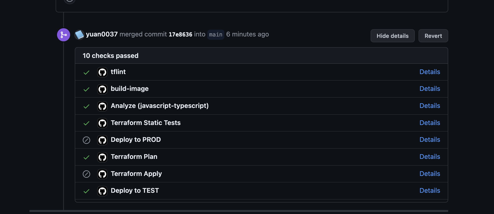

# cst8918 Final Project

## Team Members
* Shifeng Song [Github Profile](https://github.com/luckyeven)
* Bo Yuan yuan0037 [Github Profile](https://github.com/yuan0037)
* Yingda Zhang zhan0865 [Github Profile](https://github.com/Yzhan498)

## Workflows Created
1. App Infrastructure - infra_app_ci_cd.yml. PR on main branch will invoke "Terraform Plan" task. Merges to the main branch and plan change will invoke "Terraform Apply". 
2. Backend CD - infra_app_backend.yml. Merges on main branch and changes in 'infra/tf-backend/' will invoke this workflow. 
3. CD for Test and Prod - infra_app_ci_cd.yml. Merges to the main branch and files changed in 'infra/tf-app/' will invoke the deployment to the prod cluster from the lastest built image specified by the tag. PR on the main branch will invoke the rebuild of the docker image and the deployment to the test cluster with the latest image specified by the tag. 
4. Terraform Static Tests - Any pushes to any branch will invoke the static tests. 
5. CodeQL - Tests from Github on code scanning. 

## Workflows invoked on PR creation to main branch

